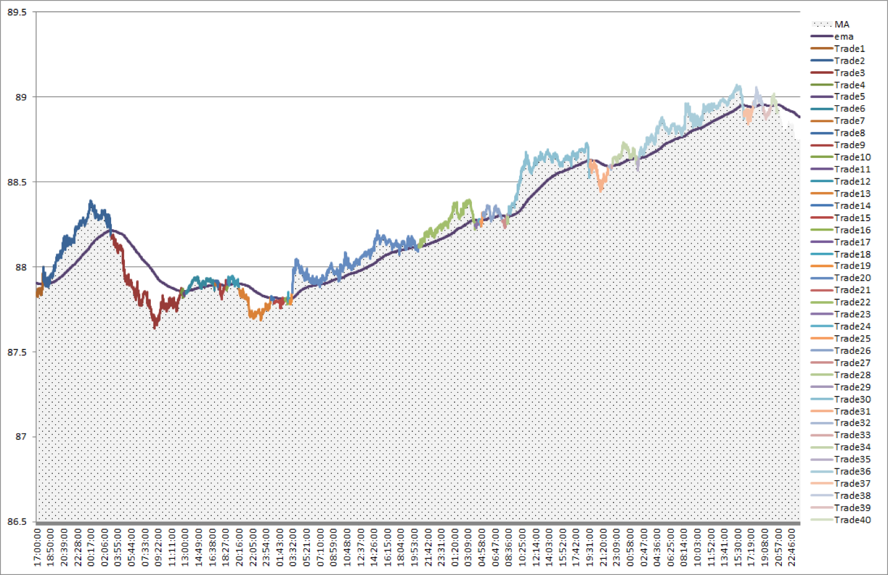
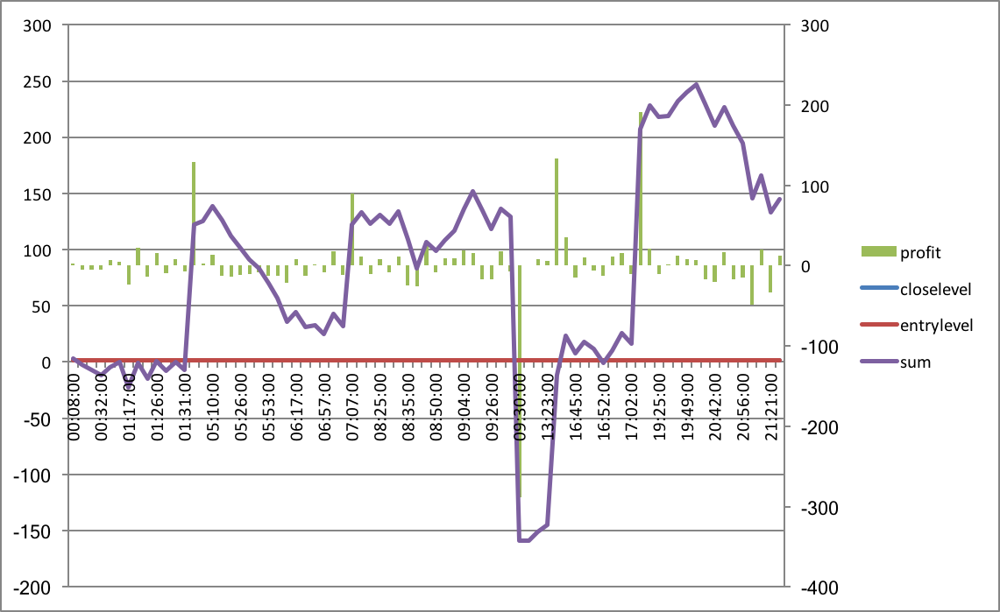

# Trading Algo :chart_with_upwards_trend:
#### :warning: **EN CONSTRUCTION** :warning:

Repo d'un projet perso d'algo de trading en python. \
le projet se base sur deux pillier , Backtest et Live Trading

## Dépendances & Technologie utilisé

- OAuth 1 & 2
- pandas (Principalement dataFrame)
- tkinter
- LightStreamer API (IGmarkets Serveur)
- IGMarkets Rest API 
- tweepy ( feature non implanté pour l'instant)

## Usage

#### `Backtest`
La partie backtest récupere des prix sous format csv (je conseille vivement [histdata.com](www.histdata.com))
ou depuis le serveur du broker sous forme json (ici IG Markets). \
Afin de testé la stratégie programmé dans la classe [stratégie](strategie.py) .\
les résultats obtenu sont ensuite converti vers un fichier Excel synthétisant les trades .

#### `Live Trading`

Le programme permet du trading automatique en temps réel de la stratégie
grace a l'API du serveur LightStreamer de IG Markets,
de plus plusieurs methodes dans [Rest](rest.py) permettent d'accéder au PnL, 
l'id IG Markets et autre données fourni par le courtier. \
Une interface codé sous Tkinter est aussi incluse,
elle résumé le prix , quelque indicateurs clefs en temp réel , 
ainsi que les trade passé

#### Exemple : 

*  resultat d'un backtest sous excel Trade/Prix

* issue des trades d'une stratégie sur une journée

## Auteurs

- **Florian Geffry (Boulton)**

## Licence

Ce projet est régie par une licence MIT -  ci joint : [MIT-license](LICENSE.md)